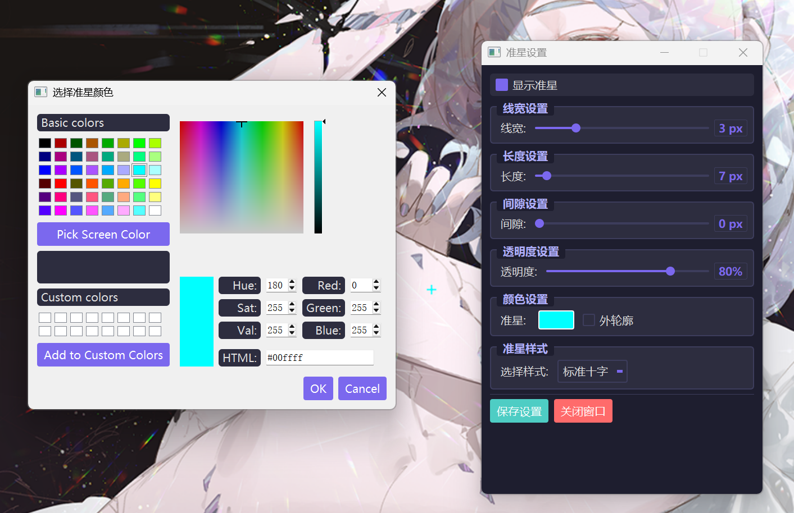

# 准星工具 - Crosshair Tool



## 📌 项目简介

**准星工具** 是一款为游戏玩家设计的屏幕准星增强工具。它可以在屏幕中央显示一个可自定义的准星，支持多种样式和颜色调整，满足不同游戏的瞄准需求。

### ✨ 主要特性

- 🎯 **屏幕中央显示** - 准星始终位于屏幕中心，置顶显示
- 🎨 **完全自定义** - 支持调整线宽、长度、间隙、颜色、透明度等参数
- 🔄 **多种样式** - 标准十字、带中心点十字、圆圈准星
- ⚡ **高性能** - 占用资源极少，不影响游戏性能
- 🖥️ **透明背景** - 准星窗口完全透明，不遮挡游戏画面
- 📦 **便携式** - 单文件exe，无需安装，即开即用

## 🚀 快速开始

### 下载运行

1. 从 [Releases](https://github.com/liang-weixi/crosshair-tool/releases) 页面下载最新版本的 `CrosshairTool.exe`
2. 双击运行（无需安装）
3. 在系统托盘中找到准星图标（红色十字），双击打开设置

### 从源码运行

```bash
# 克隆仓库
git clone https://github.com/yourusername/crosshair-tool.git

# 进入目录
cd crosshair-tool

# 安装依赖
pip install PyQt5

# 运行程序
python crosshair_tool.py
```

## 🎮 使用说明

### 系统托盘操作

| 操作 | 功能 |
|------|------|
| 双击图标 | 打开设置窗口 |
| 右键单击 | 显示快捷菜单 |
| 右键菜单-显示设置 | 打开设置窗口 |
| 右键菜单-显示/隐藏准星 | 快速切换准星显示 |
| 右键菜单-退出 | 退出程序 |

### 设置窗口功能

#### 1. 基本控制
- **显示准星** - 勾选后在屏幕中心显示准星

#### 2. 外观调整
| 参数 | 范围 | 说明 |
|------|------|------|
| 线宽 | 1-10像素 | 准星线条的粗细 |
| 长度 | 5-50像素 | 准星臂的长度 |
| 间隙 | 0-20像素 | 中心空白区域大小 |
| 透明度 | 10%-100% | 准星的不透明度 |

#### 3. 颜色设置
- **准星颜色** - 点击色块选择任意颜色
- **外轮廓** - 勾选后为准星添加黑色轮廓，提高可见度

#### 4. 准星样式
- **标准十字** - 经典的四方向十字
- **十字带点** - 中心带圆点的十字
- **圆圈** - 环形准星，可调整间隙显示十字线

#### 5. 保存设置
- 点击"保存设置" - 保存当前配置，下次启动自动加载
- 点击"关闭窗口" - 关闭设置界面

## 🛠️ 高级技巧

### 游戏中使用
1. 先开启游戏，进入全屏模式
2. 按 `Alt+Tab` 切换到桌面
3. 打开准星工具并启用准星
4. 切换回游戏 - 准星会显示在游戏画面上层

### 多配置文件
可以通过复制exe文件，为不同游戏保存不同的配置。

### 准星推荐配置

| 游戏类型 | 推荐样式 | 颜色 | 透明度 |
|----------|----------|------|--------|
| FPS射击 | 标准十字（细线） | 绿色/红色 | 80% |
| MOBA | 十字带点 | 亮色（黄/白） | 70% |
| 狙击 | 圆圈 | 蓝色 | 60% |

## 📦 打包指南

如需自行打包exe文件：

```bash
# 安装PyInstaller
pip install pyinstaller

# 打包命令
pyinstaller -F -w -i crosshair.ico --hidden-import=PyQt5.QtCore --hidden-import=PyQt5.QtGui --hidden-import=PyQt5.QtWidgets crosshair_tool.py
```

## ⚙️ 系统要求

- **操作系统**：Windows 7/8/10/11 (64位)
- **硬件要求**：极低，任何配置均可运行
- **依赖**：无需安装额外组件（exe版本）

## ❓ 常见问题

### Q: 准星在游戏中不显示？
A: 确保已勾选"显示准星"，且游戏运行在窗口模式或全屏窗口模式。部分全屏独占游戏可能无法显示，建议使用无边框窗口模式。

### Q: 程序被杀毒软件误报？
A: 本程序完全开源，代码可审查。如遇误报，请添加信任或从源码自行编译。

### Q: 如何调整准星位置？
A: 准星固定位于屏幕中心，如需调整，可配合Windows显示设置中的缩放功能。

### Q: 能否同时显示多个准星？
A: 当前版本不支持，可以通过多开程序实现，但不推荐。

## 📝 更新日志

### v1.0.0 (2024-01-01)
- 初始版本发布
- 基础准星显示功能
- 完整的自定义选项
- 系统托盘支持

## 🤝 贡献指南

欢迎提交Issue和Pull Request！

1. Fork 本仓库
2. 创建您的特性分支 (`git checkout -b feature/AmazingFeature`)
3. 提交您的更改 (`git commit -m 'Add some AmazingFeature'`)
4. 推送到分支 (`git push origin feature/AmazingFeature`)
5. 打开一个 Pull Request

## 📄 许可证

本项目采用 MIT 许可证 - 详见 [LICENSE](LICENSE) 文件

## 👨‍💻 作者

- **liang-weixi** -  [GitHub](https://github.com/liang-weixi)

## 🙏 致谢

- PyQt5 团队提供优秀的GUI框架
- 所有使用本工具的游戏玩家

## 📞 联系方式

- 提交 Issue: [GitHub Issues](https://github.com/liang-weixi/crosshair-tool/issues)
- 邮箱：a1931243068@163.com

---

**⭐ 如果这个工具对你有帮助，请给个Star！**

**注意**：本工具仅用于辅助游戏，请遵守游戏规则，合理使用。